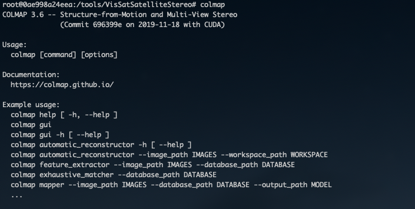
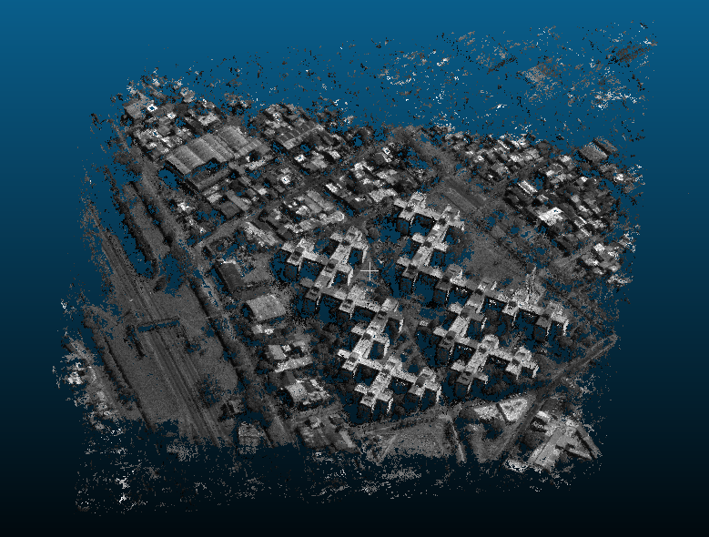

## Notes

The docker container is built using the `cuda 10.0` devel container which contains the cuda headers and other files necessary for development. To succesfully generate the pointclouds the colmap binary requires a cuda enabled graphics card. When compiling from source if colmap doesn't detect the cuda headers it will compile w.o cuda support. Compiling using the development container solves this issue.

I was able to build successfully with `cuda 10.2`, however it seems that later cuda versions will potentially not build successfully on machine w.o cuda supported graphics cards aka [Apple devices](https://gizmodo.com/apple-and-nvidia-are-over-1840015246).

This could also be an issue with colmap itself not upporting `cuda 10.3+`. I haven't dug into the issue so I'm not sure.

I attempted to build with `cuda 11.0` and it failed miserably.

To check that comap was compiled correctly with CUDA support you can run the `colmap` command after staring the command. The output should look similar to the following image and include the `with CUDA` note



## Setup

The vissat pipeline is split into various stages. The first few stages can be run without a CUDA supported graphics card.

To run the full pipeline you will need to have the appropraite nvidia-drivers and properly configure nvidia-docker and bind the graphics card to the container.

To do so, follow the [nvidia documentation](https://github.com/NVIDIA/nvidia-docker)

Pull the pre-built vissat docker image or compile your own using the included [Dockerfile](Dockerfile)

```
docker pull sebasmurphy/vissat
```

## Imagery

I've run this code successfully against the IARPA mvs competition dataset over SAO PAULO, Brazil. The default vissat configuration file UTM bounding box is configured to process a ROI from the dataset, although this can be changed to match whatever imagery and ROI you want.

You can grab the panachromatic competition imagery from the following s3 bucket

`s3://spacenet-dataset/Hosted-Datasets/MVS_dataset/WV3/PAN`

There is also SWIR imagery, available although I have not run the program against it.

`s3://spacenet-dataset/Hosted-Datasets/MVS_dataset/WV3/SWIR`

## Running

Follow the [vissat documentation](https://github.com/Kai-46/VisSatSatelliteStereo)

There are no static/hardcoded volumes so you'll need to pass the appropriate `volume -v` flag when running the container.

The paths for imagery and outputs are all configurable in the vissat `config.json` file.

> Some example docker commands

```
# Ex. docker command - no CUDA

docker run -v /source_folder:/dest_folder -it 6b0 /usr/bin/python3 stereo_pipeline.py --config_file /dest_folder/config.json

```

```
# Ex. docker command - CUDA

docker run --gpus all -v /source_folder:/dest_folder -it 6b0 /usr/bin/python3 stereo_pipeline.py --config_file /dest_folder/config.json

```

## Output

Below is an example of the `fused.ply` output as a sanity check.


